# LISA: Light-based In-field Spectral Analyser
## Autonomous Agent & Team Execution Operating Manual (`agent.md`)

> **"Foldscope made microscopy cheap enough for everyone. LISA does the same for water chemistry."**  
> **Event:** Ashoka Startup Challenge (24-Hour Master Plan)  
> **Scientific Foundation:** Feng et al., *Sensors & Actuators B: Chemical* 462 (2026) 140011  
> **Repository:** `lisa` | **Target Prototype Cost:** ₹500–₹2,500 (Scale Target: <₹600)

---

## 1. Executive Summary & Core Takeaways

### 1.1 The Problem & The Gap
- **Scale of Crisis:** 2.1 billion people globally lack safely managed drinking water (WHO/UNICEF JMP 2025). In India's CGWB 2024 survey, 19.8% of groundwater samples exceeded nitrate limits, 13.2% exceeded iron limits, and 9.04% exceeded fluoride limits (Sonipat district is explicitly flagged for fluoride).
- **The Operational Gap:** 
  - Centralized accredited laboratories provide high accuracy but take days/weeks, require cold-chain sample transport, and charge per-parameter fees.
  - Field Testing Kits (FTKs) deployed under Jal Jeevan Mission (JJM)—used by 24.8 lakh trained women—rely on human visual color matching against printed paper charts. Results are subjective, lighting-dependent, officially only "indicative", and leave zero digital audit trail.
- **The LISA Solution:** A frugal, Foldscope-style smartphone spectrometer turning ubiquitous mobile devices into objective, digital, field-deployable water chemistry labs. LISA captures real-time spectral absorption ($400–700\text{ nm}$), extracts chemical concentrations via Beer-Lambert / regularized regression models, checks against Bureau of Indian Standards (BIS IS 10500:2012) drinking water limits, provides multilingual voice readouts (Hindi/English), and logs geotagged results to a community water map.

### 1.2 The Three Golden Rules (Kickoff Commandments)
1. **One test that really works beats six that sort of work:** Phosphate (molybdenum blue) is Test #1. Iron is a stretch bonus strictly conditional on Gate 2 completion.
2. **Never fake a number:** Other parameters (Fluoride, Nitrate, Chlorine, Lead) must be transparently tagged "in development". Absolute scientific honesty wins technical judges.
3. **Proof beats promises:** The climactic pitch moment is a live blind test chosen by a judge, measured on-stage, and matched against a sealed key and chemistry department UV-Vis spectrophotometer benchmark data.

### 1.3 The Four Unfair Advantages
1. **Peer-Reviewed Scientific Pedigree:** Builds upon Feng et al. (Sensors & Actuators B, 2026), proving that smartphone spectrometers achieve <10% relative error and RSD <1% compared to benchtop laboratory instruments.
2. **Head-to-Head Lab Validation:** Direct split-sample comparison against the university chemistry department UV-Vis spectrophotometer (₹X-lakh instrument vs ₹2,000 kit).
3. **Interactive Judge-Picked Blind Sample:** Real-time demonstration with judge participation, removing skepticism of canned demos.
4. **Existing Government Workflow Integration:** Directly enhances JJM's existing network of 24.8 lakh field workers by replacing ambiguous naked-eye color comparison with digital, geotagged quantification.

---

## 2. Team Lanes, Responsibilities & Definition of Done

| Role / Owner | Primary Responsibilities | Main Gate 2 Deliverable (T+8h) | Stage & Pitch Role | Definition of Done |
| :--- | :--- | :--- | :--- | :--- |
| **Yash**<br>*(Tech Lead)* | App deployment, optical alignment, camera controls, live calibration, software QC | App deployed on demo phones, live rainbow spectrum captured, wavelength calibrated | Operates demo phone, runs live scan & explains optical/software mechanics | Real calibration on demo phone ($R^2 \ge 0.99$), exported backup JSON, 2-min screen video backup |
| **Raj**<br>*(Science Lead)* | Lab booking, UV-Vis benchtop reference, reagent preparation, standards series, chemical safety | Reagents R1–R3 prepared, 7 phosphate standards (0–1.0 mg P/L) created & read on UV-Vis | Handles chemistry, safety, limits (ortho-P vs total P, lead feasibility) | Labeled reagent bottles, 7 standards + 3 blind samples, lab reference values logged |
| **Stuti**<br>*(Story Lead)* | Pitch deck authoring, storyline, citations verification, lead presenter | Slides 1–6 drafted, problem/market statistics verified against primary sources | Lead speaker, opening hook, problem narrative, solution framing, closing ask | Final 12-slide deck frozen at T+18h (PDF on 2 laptops + USB), 3-min & 5-min timings rehearsed 3x |
| **Aditi**<br>*(Data & Proof)* | Measurement data logging, real water sample collection, blind sample coding, Q&A drill master | Google Sheets data log active, real campus/Sonipat water samples collected & labeled | Offers blind vials to judges, holds sealed truth envelope, reveals result | Complete data sheet, samples collected/labeled, sealed blind test kit ready, 2 Q&A drills completed |
| **Parth**<br>*(Build & Logistics)* | Enclosure cutting/folding, optical mount, procurement, B-roll filming, stage timekeeper | Enclosure v1 functional, procurement receipts logged, B-roll footage captured | Stage manager, hands over props/cuvettes, displays time cards (1 min / 30s) | Two working enclosures (v1 + cleaner v2), 60–90s B-roll video exported, stage kit packed |

---

## 3. Scientific & Engineering Principles

### 3.1 Beer-Lambert Law & Photometric Math
Spectrometric concentration determination relies on absorbance:
$$A(\lambda) = -\log_{10}\left(\frac{I_{\text{sample}}(\lambda)}{I_{\text{blank}}(\lambda)}\right) = \varepsilon(\lambda) \cdot \ell \cdot c$$
- $A(\lambda)$: Absorbance at specific wavelength $\lambda$
- $I_{\text{sample}}(\lambda)$: Transmitted light intensity through sample
- $I_{\text{blank}}(\lambda)$: Transmitted light intensity through reagent/solvent blank
- $\varepsilon(\lambda)$: Molar absorptivity of chromophore ($L \cdot \text{mol}^{-1} \cdot \text{cm}^{-1}$)
- $\ell$: Optical path length ($10\text{ mm} = 1.0\text{ cm}$ standard cuvette)
- $c$: Analyte concentration ($\text{mg/L}$ or $\text{mol/L}$)

Linear calibration models:
$$A_{\text{peak}} = k \cdot c + b \quad \left(\text{Target } R^2 \ge 0.99\right)$$

### 3.2 Smartphone Spectrometer Architecture
- **Light Source:** High-CRI white LED (external USB LED stick powered by power bank for rock-solid voltage stability; Plan B: phone torch/flash via light guide).
- **Sample Cell:** $10\text{ mm}$ path length standard polystyrene (PS) / PMMA optical cuvette.
- **Aperture/Slit:** Dual razor-blade entrance slit ($0.1–0.2\text{ mm}$ gap) creating a quasi-collimated light sheet.
- **Dispersive Element:** High-efficiency transmission diffraction grating film ($1000\text{ lines/mm}$ or $500\text{ lines/mm}$, or peeled DVD-R substrate layer).
- **Detector:** Smartphone CMOS camera sensor with manual exposure, ISO, and focus lock.
- **Grating Dispersion Geometry:**
  $$\sin \alpha \approx \frac{\lambda_{\text{centre}}}{d}$$
  - For $1000\text{ lines/mm}$ ($d = 1000\text{ nm}$), $\lambda = 550\text{ nm} \implies \alpha \approx 33^\circ$
  - For DVD-R piece ($d \approx 740\text{ nm}$), $\lambda = 550\text{ nm} \implies \alpha \approx 48^\circ$
  - For $500\text{ lines/mm}$ ($d = 2000\text{ nm}$), $\lambda = 550\text{ nm} \implies \alpha \approx 16^\circ$

### 3.3 Atomic Emission Wavelength Calibration
Wavelength mapping ($\text{pixel column} \to \lambda\text{ [nm]}$) utilizes mercury emission lines from a standard compact fluorescent lamp (CFL):
- **Hg Blue line:** $435.8\text{ nm}$
- **Hg Green line:** $546.1\text{ nm}$
- **Europium / Terbium Red phosphor lines:** $611.2\text{ nm}$ and $631\text{ nm}$
- **Fit equation:** $\lambda(x) = a \cdot x + b$ ($R^2 \ge 0.999$)
- *Alternative fallback:* Red ($650\text{ nm}$) and Green ($532\text{ nm}$) laser pointers.

### 3.4 Key Differentiators vs Academic Baseline (Feng et al., 2026)

| Parameter | Feng et al. (2026) Reference Paper | LISA Hackathon & Field Device |
| :--- | :--- | :--- |
| **Enclosure & Optics** | Machined metal optics, quartz cuvette, fiber-optic coupling, 3D printed housing | Origami folded card body (Foldscope-style), plastic cuvettes, razor-blade slit, film grating |
| **Device Cost** | <$700 retail ($4,000 fiber spec benchmark) | ₹500–₹2,500 prototype; target <₹600 at production scale |
| **Analyte Target** | Single-analyte: Total Phosphorus (TP) | Modular chemistry packs: Orthophosphate (Test 1), Iron (Test 2), Fluoride, Nitrate |
| **Real Sample Chemistry** | Filtered without autoclave digestion (measured orthophosphate under the name TP) | Explicitly targets orthophosphate as pollution tracer; scientifically rigorous disclosure |
| **Software & UI** | Cloud-tethered processing, desktop/English UI | 100% offline-first standalone web app, Hindi voice synthesizer, WhatsApp/CSV export |
| **Deployment Model** | Research labs, industrial monitoring in China | Integrated into India's Jal Jeevan Mission FTK rural testing workflow |

---

## 4. Hardware Assembly & Bill of Materials (BOM)

### 4.1 Bill of Materials

| Component | Technical Specification | Sourcing Channel | Estimated Cost (₹) |
| :--- | :--- | :--- | :--- |
| **Diffraction Grating** | Transmission film $1000\text{ lines/mm}$ (backup: peeled DVD-R) | Physics teaching lab / online | ₹0 – ₹500 |
| **Optical Cuvettes** | 6× standard $10\text{ mm}$ path plastic (PS/PMMA) or glass | Chemistry department lab | ₹0 – ₹300 |
| **White LED Light** | USB LED stick (constant power) or 5mm white LED + CR2032 | Stationery / quick-commerce | ₹50 – ₹150 |
| **Power Source** | Portable USB Power Bank (eliminates battery voltage sag) | Team equipment | ₹0 |
| **Enclosure Card** | 4× A4 sheets of 300 gsm matte black cardstock | Stationery store | ₹40 – ₹80 |
| **Anti-Reflective Tape** | 2× rolls matte black electrical/PVC insulation tape | Hardware store | ₹40 – ₹80 |
| **Entrance Slit** | 2× double-edge carbon/steel razor blades | Pharmacy / general store | ₹10 – ₹20 |
| **Light Diffuser** | Matte tracing paper or semi-translucent HDPE milk container sheet | Stationery / domestic | ₹0 – ₹10 |
| **Phone Coupling** | Cheap TPU phone case for demo device (glued alignment) | Phone accessory shop | ₹100 – ₹200 |
| **Fasteners/Adhesives**| Hot glue gun + sticks, utility knife, steel ruler, cutting mat | Makerspace / hostel | ₹0 – ₹200 |
| **Chemical Reagents** | Analytical grade salts & acid for molybdenum blue | Chemistry lab stock | ~₹0 – ₹500 |
| **Filtration** | $0.45\ \mu\text{m}$ syringe filters or Grade 1 filter paper + funnel | Chemistry/biology lab | ₹0 – ₹300 |
| **Total Prototype** | — | — | **≈ ₹500 – ₹2,500** |

### 4.2 Mechanical Assembly Protocol (Appendix B Template: 1:1 Scale)
1. **Print & Verify Template:** Print Appendix B at 100% scale (disable "fit to page"). Verify 50 mm calibration bar with a precision ruler.
2. **Main Optical Tube (A):** Fold into a $30 \times 30\text{ mm}$ square cross-section, $110\text{ mm}$ length. Thoroughly line interior with matte black tape to eliminate internal reflections.
3. **Cuvette Chamber (B):** Construct $14 \times 14\text{ mm}$ inner cavity, $45\text{ mm}$ height. Cut opposing $8 \times 20\text{ mm}$ optical transmission windows. Glue firmly across tube entrance.
4. **Slit Assembly (C):** Affix two razor blades edge-to-edge across slit window, leaving an exact $0.1–0.2\text{ mm}$ parallel gap (thickness of standard 80 gsm copy paper). Mount between cuvette chamber and optical tube.
5. **Illumination Port (D):** Place LED behind light diffuser on outer cuvette wall. Seal light leaks with black tape.
6. **Grating Mounting:** Cut $15 \times 15\text{ mm}$ grating film. Tape over demo phone primary rear camera lens. Ensure ruling orientation spreads spectral rainbow horizontally across camera sensor.
7. **Angular Alignment Wedge (E):** Attach tube to angular wedge ($33^\circ$ for 1000 lines/mm, $48^\circ$ for DVD-R, $16^\circ$ for 500 lines/mm). Align until green region ($550\text{ nm}$) lands centered on camera sensor. Seal joint with black shroud.
8. **Enclosure Duplication:** Parth fabricates Enclosure v2 immediately upon v1 optical verification to ensure hot-standby redundancy.

---

## 5. Analytical Chemistry Protocols

### 5.1 Safety Directives (Zero Compromise)
- **Acid Handling:** Concentrated sulfuric acid ($H_2SO_4$) must be handled **only by Raj** in a chemical fume hood wearing lab coat, safety goggles, and nitrile gloves. **Always add acid to water slowly, never water to acid.**
- **Toxicity:** Ammonium molybdate, antimony potassium tartrate, and 1,10-phenanthroline are hazardous. Collect all chemical waste in dedicated laboratory containers.
- **Stage Safety:** **No open acids or raw chemical stocks allowed at the competition venue.** All stage demonstration samples and blanks must be pre-reacted in capped, sealed cuvettes.

### 5.2 Test #1: Orthophosphate (Molybdenum Blue Method)
- **Standard Reference:** US EPA Method 365.3 / Murphy & Riley (1962), scaled for 10 mL volume.
- **Reaction Mechanism:** Orthophosphate reacts with ammonium molybdate under acidic conditions with an antimony catalyst to form 12-molybdophosphoric acid, which is reduced by ascorbic acid to intense molybdenum blue complex ($A_{\text{peak}} \sim 880\text{ nm}$, strong broad absorption across $600–700\text{ nm}$).
- **Reagent Formulations:**
  - **R1 ($11\text{ N } H_2SO_4$):** Add $31\text{ mL}$ conc. $H_2SO_4$ to $\sim 60\text{ mL}$ distilled water, cool, bring to $100\text{ mL}$.
  - **R2 (Molybdate-Antimony):** Dissolve $0.8\text{ g}$ ammonium molybdate + $0.02\text{ g}$ antimony potassium tartrate in distilled water; make up to $100\text{ mL}$. Store in amber bottle.
  - **R3 (Ascorbic Acid):** Dissolve $6.0\text{ g}$ L-ascorbic acid in distilled water, dilute to $100\text{ mL}$. (Must be prepared fresh daily).
  - **Stock Standard ($100\text{ mg P/L}$):** Dissolve $0.4393\text{ g}$ anhydrous potassium dihydrogen phosphate ($KH_2PO_4$) in $1.0\text{ L}$ distilled water.
  - **Working Standard ($1.0\text{ mg P/L}$):** Dilute $1.0\text{ mL}$ stock to $100\text{ mL}$ with distilled water.
- **Standard Calibration Series (10 mL total volume):**

| Standard ID | Target [mg P/L] | Working Soln (1.0 mg/L) | Distilled Water |
| :---: | :---: | :---: | :---: |
| **Std 0 (Blank)** | 0.00 | 0.0 mL | 10.0 mL |
| **Std 1** | 0.10 | 1.0 mL | 9.0 mL |
| **Std 2** | 0.20 | 2.0 mL | 8.0 mL |
| **Std 3** | 0.40 | 4.0 mL | 6.0 mL |
| **Std 4** | 0.60 | 6.0 mL | 4.0 mL |
| **Std 5** | 0.80 | 8.0 mL | 2.0 mL |
| **Std 6** | 1.00 | 10.0 mL | 0.0 mL |

- **Sample Reaction Assay Protocol:**
  1. Transfer $10.0\text{ mL}$ sample or standard into clean tube (rinse glassware with dilute acid, never phosphate detergents).
  2. Add $0.2\text{ mL}$ R1, add $0.8\text{ mL}$ R2; mix thoroughly.
  3. Add $0.4\text{ mL}$ R3; invert to mix; trigger 5-minute reaction timer.
  4. Transfer $\sim 3\text{ mL}$ into cuvette, wipe optical faces with lint-free lens tissue, place into holder with index mark facing light source, and capture spectrum.
  5. Conversion factor: $\text{mg } PO_4^{3-}/L = 3.07 \times \text{mg P/L}$.

### 5.3 Test #2: Total Iron (1,10-Phenanthroline Stretch Goal)
- **Standard Reference:** APHA 3500-Fe B.
- **Reaction Mechanism:** Hydroxylamine hydrochloride reduces $\text{Fe}^{3+}$ to $\text{Fe}^{2+}$. Three molecules of 1,10-phenanthroline chelate $\text{Fe}^{2+}$ to form stable orange-red tris(phenanthroline)iron(II) complex ($\lambda_{\max} \approx 508–510\text{ nm}$, $\varepsilon \approx 11,100\text{ L}\cdot\text{mol}^{-1}\cdot\text{cm}^{-1}$).
- **Reagent Formulations:**
  - Hydroxylamine HCl: $10\text{ g} / 100\text{ mL}$.
  - 1,10-Phenanthroline: $0.1\text{ g} / 100\text{ mL}$ (warm gently to dissolve).
  - Sodium acetate buffer ($1.2\text{ M}$): $9.8\text{ g}$ anhydrous in $100\text{ mL}$.
  - Iron Stock ($10\text{ mg Fe/L}$): $0.0702\text{ g}$ ferrous ammonium sulfate hexahydrate $+ 2.5\text{ mL}$ conc. $H_2SO_4$ to $1.0\text{ L}$.
- **Reaction Protocol:** To $10.0\text{ mL}$ sample, add $0.1\text{ mL}$ hydroxylamine + $1.0\text{ mL}$ phenanthroline + $0.8\text{ mL}$ acetate. Wait 10 min; read absorbance at $510\text{ nm}$.

### 5.4 Real Sample Collection Plan (Aditi + Parth)
1. **Hostel Tap Water & Water Cooler:** Represents local campus drinking water ("Your water, tested today").
2. **Sonipat Drain / Pond Water:** Real-world surface runoff containing matrix colors and turbidity.
3. **Spiked Agricultural Runoff:** Tap water with a trace pinch of DAP (diammonium phosphate) fertilizer.
4. **Laundry Detergent Wash/Rinse:** Surfactant water containing commercial polyphosphates.
5. **Borewell / Hand-Pump Water:** Natural groundwater tested for background iron.

---

## 6. Software Architecture & Intelligent Processing (`lisa-app.html`)

### 6.1 Application Design
- **Single-File Architecture:** Fully self-contained HTML5/CSS3/JavaScript (`lisa-app.html`), zero build steps, zero external CDN dependencies, fully functional offline once cached.
- **Tri-Mode Operational Fallback:**
  1. *Live Camera Mode:* Native Android Chrome with `MediaStreamTrack` advanced constraints (`exposureMode: 'manual'`, `exposureCompensation`, `torch`, `focusMode: 'manual'`).
  2. *Photo Upload Mode:* Universal iOS Safari & browser fallback; imports pre-locked AE/AF still captures from device camera roll.
  3. *Physics Synthetic Simulator:* Built-in Monte Carlo noisy spectral generator for testing and demonstration rehearsals (all outputs watermarked "SIMULATED").
- **Secondary Modality:** Spectrometer Mode vs Colorimeter (RGB) Mode. If grating fails, app reads direct RGB transmission channels ($A_{\text{red}}$ for phosphate, $A_{\text{green}}$ for iron).

### 6.2 Data Processing Pipeline
1. **ROI Extraction:** Automatic or manual bounding box selection of the dispersed horizontal spectrum band.
2. **Column Binning:** Column-wise spatial averaging of RGB pixel intensities within the ROI to extract a 1D raw transmission profile $I(x)$.
3. **Cross-Correlation Alignment:** Spatial cross-correlation between sample profile $I_{\text{sample}}(x)$ and blank profile $I_{\text{blank}}(x)$ over $\pm 10\text{ pixels}$ to correct for mechanical insertion shifts.
4. **Spectral Registration:** Mapping pixel coordinates $x \to \lambda$ via quadratic or linear CFL mercury line dispersion fit. Resampled to standard $400–700\text{ nm}$ grid in $2\text{ nm}$ increments.
5. **Absorbance Calculation:** $A(\lambda) = -\log_{10}(I_{\text{sample}}(\lambda) / I_{\text{blank}}(\lambda))$.

### 6.3 Machine Learning & Calibration Algorithms
- **Dual-Model Engine:**
  - *Model A (Beer-Lambert Band):* Single integrated peak absorption over the nominal analyte band ($630–690\text{ nm}$ for phosphate).
  - *Model B (Full-Spectrum Ridge Regression):* $L_2$-regularized multivariate regression across all resampled wavelengths $\mathbf{A} \in \mathbb{R}^{151}$:
    $$\hat{\mathbf{w}} = \left(\mathbf{X}^T\mathbf{X} + \alpha \mathbf{I}\right)^{-1}\mathbf{X}^T\mathbf{y}$$
  - *Automated Model Selection:* App evaluates Leave-One-Out Cross-Validation (LOOCV) Root Mean Square Error (RMSE) on both models during calibration and deploys whichever demonstrates superior predictive precision.
- **Automated Quality Control (QC) System:**
  - *Pixel Saturation Flag:* Any raw pixel $\ge 250$ triggers immediate exposure reduction warning.
  - *Cuvette Misalignment Flag:* Cross-correlation spectral shift $\ge 6\text{ px}$ flags improper cuvette seating.
  - *Turbidity / Matrix Interference Flag:* Uncharacteristic non-zero baseline absorbance outside the active chromophore absorption band triggers automatic suggestion: *"Turbid sample detected. Please perform sample blank."*
  - *Dynamic Range Clamping:* Concentrations below calculated Limit of Detection report `"< LOD"` rather than false numerical values; concentrations above highest standard prompt `"Sample above range: Dilute 1:10"`.

### 6.4 Human Interface & Accessibility
- **Speech Synthesis:** Web Speech API (`speechSynthesis`) delivers audible diagnostic readouts in Hindi and English for accessibility.
- **Decisional Thresholds:** Direct comparison against Bureau of Indian Standards (IS 10500:2012) and EPA guidelines:
  - Phosphate: Normal $<0.05\text{ mg/L}$, Caution $0.05–0.10\text{ mg/L}$, Alert $>0.10\text{ mg/L}$.
  - Iron: Normal $<0.30\text{ mg/L}$, Caution $0.30–1.00\text{ mg/L}$, Alert $>1.00\text{ mg/L}$.
- **Data Export:** Instant JSON backup, CSV export, HTML5 geolocation capture, and formatted WhatsApp message sharing.

---

## 7. Calibration, Validation & Quality Assurance Protocol

### 7.1 Execution Steps (Yash + Raj + Aditi)
1. **Instrument Calibration (15 min):** Insert reagent blank cuvette $\to$ Auto-detect ROI $\to$ Lock exposure (peak intensity 150–220) $\to$ Capture CFL lamp spectrum $\to$ Map 436, 546, 611 nm lines ($R^2 \ge 0.999$) $\to$ Capture dark frame.
2. **Chemical Calibration (45 min):** Capture reagent blank $\to$ Sequentially scan 7 standards (0.0 to 1.0 mg P/L) in triplicate ($7 \times 3 = 21$ data points), re-seating cuvette between each capture $\to$ Compute linear regression, LOOCV, LOD, and LOQ $\to$ Export calibration JSON.
3. **Lab Spectrophotometer Benchmark:** Run identical standard cuvettes on university chemistry UV-Vis spectrophotometer at $650\text{ nm}$ and $880\text{ nm}$ to establish the gold-standard reference curve.

### 7.2 Gate 2 Acceptance Criteria Checklist

| Analytical Metric | Target Threshold | Mathematical Definition |
| :--- | :--- | :--- |
| **Linearity** | $R^2 \ge 0.98$ (Ideal $\ge 0.99$) | $R^2 = 1 - \frac{\sum (y_i - \hat{y}_i)^2}{\sum (y_i - \bar{y})^2}$ |
| **Limit of Detection (LOD)** | $\le 0.10\text{ mg P/L}$ (Ideal $\le 0.05$) | $\text{LOD} = 3.3 \cdot \frac{s_{y/x}}{k}$ |
| **Limit of Quantitation (LOQ)**| $\le 0.30\text{ mg P/L}$ | $\text{LOQ} = 10 \cdot \frac{s_{y/x}}{k}$ |
| **Instrument Repeatability** | $\text{RSD} \le 5.0\%$ at $0.4\text{ mg/L}$ | $\text{RSD} = \frac{\sigma}{\mu} \times 100\%$ (5 re-insertions) |
| **Spike Recovery Accuracy** | $90\% - 110\%$ Recovery | $\text{Rec} = \frac{C_{\text{spiked}} - C_{\text{unspiked}}}{C_{\text{spike\_target}}} \times 100\%$ |
| **Lab UV-Vis Concordance** | Relative Error $\le 10.0\%$ | $\text{Error} = \frac{\|C_{\text{LISA}} - C_{\text{UV-Vis}}\|}{C_{\text{UV-Vis}}} \times 100\%$ |

### 7.3 Advanced Analytical Safeguards
- **Sample Blanking Technique:** For turbid, dyed, or organically colored natural water samples, run a matched aliquot containing water sample + acid/diluent without ammonium molybdate. Subtracting this profile eliminates native background color—resolving the primary source of error identified in Feng et al. (2026).
- **Spike Addition Matrix Check:** Split unknown real sample into two $10\text{ mL}$ aliquots. Add $0.2\text{ mg P/L}$ spike to one aliquot. Calculating recovery proves whether matrix salts inhibit chromophore kinetics.

---

## 8. Master 24-Hour Timeline & Milestone Gates

```mermaid
gantt
    title LISA 24-Hour Master Schedule
    dateFormat  X
    axisFormat  T+%H h
    section Governance
    Kickoff & Alignment         :done, 0, 1
    Gate 1: Optical Verification:crit, 5, 6
    Gate 2: Chemical & Cal Check:crit, 8, 9
    Feature Freeze (T+18h)      :crit, 17, 18
    section Yash (Tech)
    Deploy App & Camera Testing :0, 3
    Optics Alignment with Parth :3, 5
    Instrument & Chem Cal Run   :5, 8
    Validation & App Polish     :8, 11
    Mandatory Sleep Shift       :11, 14
    Secondary Runs / Stretch    :14, 17
    Backup Video & Rehearsals   :18, 23
    section Raj (Science)
    Lab Booking & Reagent Prep  :0, 3
    Standards Prep & UV-Vis Run :3, 5
    Standards Reaction Sequence :5, 8
    Lab UV-Vis Benchmarking     :8, 11
    Stability Monitoring & Sleep:11, 14
    Iron Stretch / Stability    :14, 17
    Fresh Reagents & Stage Prep :18, 23
    section Stuti (Story)
    Deck Architecture (Slides 1-3):0, 3
    Problem & Market Slides     :3, 5
    Solution & Optics Slides    :5, 8
    Results & Financial Slides  :8, 11
    Deck Polish & Visuals       :11, 14
    Mandatory Sleep Shift       :14, 17
    Deck Finalization & 3x Drill:18, 23
    section Aditi & Parth
    Procurement & Enclosure v1  :0, 3
    Sample Collection & v2 Build:3, 5
    Data Logging & B-Roll Video :5, 8
    Lab Data Entry & Scatter Plot:8, 11
    Staggered Sleep Shifts      :11, 17
    Q&A Drills & Stage Kit Pack :18, 23
    section Competition
    Final Stage Rehearsals      :20, 23
    Pre-React Demo Cuvettes     :23, 24
```



### 8.1 Critical Go/No-Go Decision Gates
- **T+5:00 — GATE 1 (Optics & Dispersion):**
  - *Criteria:* Is a sharp, stable, unsaturated rainbow spectrum covering $400–700\text{ nm}$ visible on camera in the web app?
  - *Decision:* YES $\to$ Proceed to CFL calibration and chemical standards. NO after 45m troubleshooting $\to$ Pivot immediately to **Plan B: Colorimeter (RGB) Mode**.
- **T+8:00 — GATE 2 (Analytical Precision & Linearity):**
  - *Criteria:* Is phosphate calibration $R^2 \ge 0.98$ and blank repeatability drift $\le \pm 0.01\text{ A}$?
  - *Decision:* YES $\to$ Proceed to real-sample validation and Iron test stretch goal. NO $\to$ 60 minutes dedicated troubleshooting (re-blank, verify razor slit, freshly dilute ascorbic acid). If still unvalidated $\to$ Fallback to Plan B / Plan C.
- **T+17:00 to T+18:00 — FEATURE FREEZE:**
  - Strict lockdown: Zero additional code edits, zero optical alterations, zero new chemical preparations. Lock exact quantitative figures onto Slide 7. Transition 100% of team bandwidth to rehearsal, stage choreography, and Q&A defense.

---

## 9. Fallback Ladder & Risk Mitigation Matrix

| Tier | Protocol Configuration | Trigger Condition | Stage Narrative / Positioning |
| :---: | :--- | :--- | :--- |
| **Plan A** | Full grating spectrometer + phosphate chemistry + live blind test + UV-Vis benchmark | Default operational path; all gates green | *"Full-spectrum $400–700\text{ nm}$ optical analysis with real-time laboratory concordance."* |
| **Plan B** | Smartphone camera in Colorimeter (RGB) mode directly facing cuvette (no grating) | Gate 1 failure (optical dispersion unresolvable or grating misplaced) | *"Today's hardware prototype reads tristimulus colorimetric absorbance; full grating dispersion is our v2 upgrade."* |
| **Plan C** | Switch primary analyte to Iron (1,10-phenanthroline, 510 nm) | Molybdenum blue reagents degrade or fail linearity threshold | *"Our flagship validated chemical pack is iron, addressing a primary IS 10500 drinking water violation."* |
| **Plan D** | High-definition 2-minute video recording of laboratory run + static app photo import | Total hardware failure, cuvette destruction, or phone breakdown at venue | *"Here is the continuous unedited validation run recorded last night in our university laboratory."* |

### 9.1 Venue Environmental Contingencies
- **Ambient Light Pollution:** Secure auxiliary light shroud around phone-cuvette junction; perform forced re-blanking on competition table under exact stage lighting conditions 2 minutes prior to pitching.
- **Loss of Network Connectivity:** Application is cached and operates 100% offline via local service worker/local storage; pitch deck backed up as local PDF across two laptops and offline USB drive.
- **Device Battery / Thermal Throttling:** Two calibrated Android phones kept at 100% charge, backed by portable power banks; screen brightness throttled to prevent sensor thermal drift.
- **Screen Casting Failure:** Parth immediately repositions physical device to face judges directly while Stuti references slide backup visuals.

---

## 10. Pitch Deck Architecture (12 Slides, 5 Minutes)

- **Aesthetic Principles:** 16:9 widescreen layout; 1 central thesis per slide; bold headlines as full declarative sentences; max 20 words body text; brand palette: Deep Teal (`#0B4F5A`), Cyan Teal (`#0E7282`), Amber Accent (`#E39B00`), Off-White background; continuous rainbow gradient motif; typography: Inter/Poppins $\ge 28\text{pt}$; numerical citations in $10\text{pt}$ muted grey.

| Slide | Title / Headline | Core Content & Visual Elements | Timing |
| :---: | :--- | :--- | :---: |
| **1** | **LISA: A Pocket Water Lab for Every Phone** | Photo of LISA folded enclosure mounted on smartphone beside hostel tap water glass. Team credentials. | 0:15 |
| **2** | **India Cannot See What Is in Its Water** | 2.1B without safe water; CGWB 2024 exceedances (19.8% nitrate, 13.2% iron, 9.04% fluoride). Map highlighting Sonipat fluoride crisis. | 0:40 |
| **3** | **Testing Today: Accurate or Accessible, Never Both** | Split visual: ₹10-lakh laboratory benchtop machine (slow, distant, costly) vs JJM field test kit color chart (subjective, unreliable, analog). | 0:30 |
| **4** | **Every Phone Is Already 75% of a Spectrometer** | Diagram showing smartphone LED, CMOS camera, and compute. Foldscope paradigm: add ₹50 optics and proven chemistry. | 0:20 |
| **5** | **LISA: Fold, Clip, Test** | End-to-end operational pipeline diagram (Figure 1): Sample $\to$ Chemistry $\to$ Spectrum $\to$ Model $\to$ BIS Verdict $\to$ Cloud Map. | 0:30 |
| **6** | **Live Demonstration** | **Judge's Choice: Blind Vial Selection.** Screen mirroring live app; QR code to live link. Handover to Yash. | **1:30** |
| **7** | **₹2,000 Hardware, Lab-Grade Precision** | Left: Linear calibration curve ($R^2 \ge 0.99$, LOD). Right: LISA vs Chemistry Dept UV-Vis scatter correlation plot with % relative error. | 0:30 |
| **8** | **One Platform, Unlimited Chemistries** | Modular chemistry packs: Orthophosphate (validated), Total Iron (stretch), Fluoride (Sonipat pack), Nitrate, Residual Chlorine. | 0:25 |
| **9** | **Competitive Advantage Matrix** | Multi-attribute comparison table: LISA vs Accredited Labs vs Color-Chart Kits vs Single-Parameter Photometers. | 0:25 |
| **10** | **Business Model: Razor & Blade** | Unit economics: Hardware ₹1,500–₹2,500; reagent refills ₹250–₹500 (50 tests); B2G (JJM), B2B (aquaculture/farms), schools. | 0:30 |
| **11** | **From Point Tests to National Water Map** | Real-time epidemiological community map mock-up with contamination cluster alerts. 12-month pilot roadmap. | 0:20 |
| **12** | **Built in 24 Hours. Scale to 24 Lakh Hands.** | Team roster, diverse cross-functional skill balance. The Ask: NABL validation partner, panchayat pilot introductions, seed grant. | 0:15 |

---

## 11. Live Demonstration Choreography (90 Seconds)

```
[0:00 - 0:10] STUTI: "This is LISA. Folded cardstock, a razor-blade slit, a ₹50 LED, and a diffraction grating over the phone camera."
              (Parth elevates physical device, showcasing compact Foldscope-style form factor.)

[0:10 - 0:20] ADITI: Steps forward with sealed acrylic rack containing 3 identical coded vials (X, Y, Z):
              "Judges, please select any one vial. Only I hold the sealed truth key."
              (Judge points to Vial Y; Aditi hands Vial Y to Yash.)

[0:20 - 0:30] YASH: Inserts blank cuvette into LISA chamber. Taps [Capture Blank] on smartphone.
              "First, we capture the solvent reference to cancel optical baseline."

[0:30 - 0:45] YASH: Swaps in Judge's Vial Y. Taps [Scan Sample]. Tilts screen toward judging panel:
              "In real time, light disperses across the camera sensor. The dip in transmission at 650–690 nm measures the molybdenum blue complex."

[0:45 - 0:55] YASH: App screen displays: '0.41 ± 0.02 mg P/L — ALERT: CONTAMINATION LIKELY'.
              Yash taps [Hindi Voice]; phone speaker states: 'फॉस्फेट की मात्रा 0.41 मिलीग्राम प्रति लीटर है. यह पानी असुरक्षित है.'

[0:55 - 1:05] ADITI: Unseals tamper-evident envelope and holds up verification card:
              "Ground truth value prepared in university lab: 0.40 mg P/L. Predictive accuracy within 2.5%."

[1:05 - 1:20] STUTI: "In our history tab, here is our Ashoka hostel tap water measured this morning, and here is Sonipat drainage water run with a sample blank to eliminate turbidity."

[1:20 - 1:30] STUTI: "Every reading is geotagged, saved offline, and shareable via WhatsApp. Imagine 24 lakh rural testers feeding this live into our national grid."
```

---

## 12. Complete Judge Q&A Battlecard (22 Questions)

*Strict answer discipline: Direct Answer (5s) $\to$ Empirical Evidence (15s) $\to$ Future Roadmap (10s).*

1. **How is this different from existing chemical color charts?**  
   *Speaker: Stuti*  
   "Color charts rely on naked-eye subjective judgment under variable ambient lighting, which studies show causes widespread misclassification. LISA uses a calibrated CMOS sensor to objectively quantify light absorption across 150 spectral bands, eliminating human bias and converting every test into an authenticated digital record."
2. **How accurate is your system compared to real lab equipment?**  
   *Speaker: Raj*  
   "In our university chemistry laboratory benchmarks, LISA achieved an $R^2 \ge 0.99$ linearity and $<10\%$ relative error against a high-end UV-Vis spectrophotometer. This directly matches the peer-reviewed findings of Feng et al. (2026). Our next phase will validate 100 blind samples against a certified NABL testing facility."
3. **Phosphate is not an IS 10500 drinking water parameter. Why choose it?**  
   *Speaker: Raj*  
   "Phosphate serves as a premier chemical tracer: clean groundwater contains negligible phosphorus, so elevated levels indicate raw sewage, detergent intrusion, or agricultural fertilizer runoff. Furthermore, it is the exact chemistry rigorously validated by Feng et al. (2026). Our second pack addresses iron—an official IS 10500 parameter—and fluoride is next."
4. **Can LISA detect heavy metals like lead or arsenic?**  
   *Speaker: Raj*  
   "Not today, and we will never make unscientific claims. The IS 10500 limit for lead is $10\ \mu\text{g/L}$ ($0.01\text{ mg/L}$). Simple transmission colorimetry cannot reliably resolve parts-per-billion levels in the field without solvent extraction. Heavy metal detection is on our research roadmap via solid-phase extraction pre-concentration cartridges."
5. **What is the functional role of Machine Learning here?**  
   *Speaker: Yash*  
   "Rather than using AI as marketing hype, LISA uses full-spectrum Ridge Regression to learn absorption coefficients across all wavelengths simultaneously, outperforming classical single-wavelength Beer-Lambert models under noisy conditions. Machine vision algorithms also automate ROI detection, correct physical cuvette drift via cross-correlation, and reject saturated or turbid captures."
6. **Every smartphone camera has different lenses and color processing. How do you scale?**  
   *Speaker: Yash*  
   "LISA's software decouples sensor physics by using native manual camera controls to disable dynamic white balance and HDR. For field scaling, we adopt Feng et al.'s cross-phone calibration matrix, which uses standard optical reference cards to normalize camera response functions across disparate Android hardware."
7. **How do you overcome ambient light leakage during testing?**  
   *Speaker: Yash*  
   "The enclosure is engineered from light-tight matte black 300 gsm cardstock lined with anti-reflective tape, forming an enclosed optical darkroom. Furthermore, absorbance is computed as a logarithmic ratio between sample and blank captured under identical conditions, canceling steady-state baseline drift."
8. **How do you handle turbid, muddy, or naturally colored water?**  
   *Speaker: Raj*  
   "Turbid samples are cleared using standard syringe filters. For colored water, LISA incorporates a proprietary 'Sample Blank' procedure: we blank the instrument using the raw water sample with acid but without molybdate, mathematically subtracting the water's background absorbance matrix before measuring the chromophore."
9. **Are these chemical reagents hazardous for rural community workers?**  
   *Speaker: Raj*  
   "Our hackathon prototype utilizes standard laboratory liquid reagents handled strictly by trained personnel. Our commercial production design packages reagents into pre-dosed, sealed, dry-powder foil blister pods—identical to the Hach and JJM field chemistries safely handled by over 24 lakh rural women today."
10. **What is the true cost structure at commercial scale?**  
    *Speaker: Stuti*  
    "Our working prototype was built for under ₹2,000. In mass production, die-cut plastic housings, mass-replicated film gratings, and LED mounts cost ₹300–₹600. The device retails at ₹1,500–₹2,500, with recurring reagent blister packs selling at ₹250–₹500 for 50 tests, costing ₹1–₹5 per test."
11. **Who is the paying customer for LISA?**  
    *Speaker: Stuti*  
    "Our primary customer channel is B2G: State Water & Sanitation Missions under Jal Jeevan Mission seeking to digitize rural monitoring. Secondary commercial channels include aquaculture farm operators, commercial soil testing labs, secondary schools for STEM chemistry education, and rural development NGOs."
12. **Why would government agencies purchase LISA over existing test kits?**  
    *Speaker: Stuti*  
    "Government bodies do not need to replace their existing testing framework; LISA enhances it. JJM field test results are legally designated as merely 'indicative'. LISA reads the exact same chemical reactions objectively, logs GPS coordinates, timestamps the test, and automates real-time compliance reporting to state dashboards."
13. **Isn't this just a replication of the Chinese research paper?**  
    *Speaker: Yash*  
    "Feng et al. proved the physics using a \$700 laboratory device designed for industrial monitoring in China. We engineered a ₹2,000 frugal Foldscope-style device tailored specifically to Indian water challenges—featuring modular packs for local contaminants, Hindi voice guidance, full offline functionality, and community mapping."
14. **What is the total turnaround time for a single test?**  
    *Speaker: Yash*  
    "Sample reaction requires 5 minutes of incubation time, followed by 5 seconds for optical scanning and algorithmic calculation. A complete field test completes in under 6 minutes, compared to 40 minutes for standard lab procedures or multiple days for remote laboratory turnaround."
15. **How do field temperature variations affect accuracy?**  
    *Speaker: Raj*  
    "Molybdenum blue reaction kinetics are temperature-sensitive below $20^\circ\text{C}$. For our prototype, we fix the reaction timer at 5 minutes. In our v2 production model, we incorporate a digital thermistor probe to apply software kinetic temperature correction curves to the calculated concentration."
16. **What is the chemical shelf-life of your testing reagents?**  
    *Speaker: Raj*  
    "While sulfuric acid and ammonium molybdate solutions remain stable for months, aqueous ascorbic acid oxidizes over several days. Our production design packages ascorbic acid in dry crystalline form within sealed moisture-barrier blister pods, ensuring a stable shelf-life exceeding 12 months."
17. **How does your Limit of Detection compare to national regulatory limits?**  
    *Speaker: Raj*  
    "LISA's limit of detection for phosphate is $\sim 0.05\text{ mg P/L}$, perfectly spanning the EPA freshwater alert threshold of $0.10\text{ mg/L}$. For our iron pack, LISA resolves $0.1\text{ mg/L}$, fully encompassing the BIS IS 10500 acceptable limit of $0.3\text{ mg/L}$ and permissible limit of $1.0\text{ mg/L}$."
18. **What is your Intellectual Property (IP) and competitive defensibility?**  
    *Speaker: Stuti*  
    "Like Foldscope, our defensibility does not rely on obscure optical physics. Our moat lies in our proprietary cross-phone sensor calibration dataset, validated pre-dosed chemistry formulations, institutional integration with rural water schemes, and network effects driven by our centralized water quality data platform."
19. **How do judges know the live demonstration is not pre-recorded or rigged?**  
    *Speaker: Aditi*  
    "The judging panel selected one vial at random from our coded tray. The code key remained inside a sealed, tamper-evident envelope held in full view of the audience. The live spectrum was processed before your eyes, and you are welcome to pick a second vial right now."
20. **What is the primary technical failure risk in field deployment?**  
    *Speaker: Yash*  
    "Optical misalignment across diverse third-party smartphone chassis and variable camera sensor post-processing. We de-risk this through rigid modular phone cases, automated cross-correlation image alignment, and standardized optical transfer calibration cards."
21. **What is your primary key performance indicator (KPI) for social impact?**  
    *Speaker: Stuti*  
    "We track four cascading metrics: Total tests administered, contaminated water sources flagged, speed of institutional remedial action, and reduction in waterborne disease incidence within deployed panchayats."
22. **Why is this specific student team capable of executing this vision?**  
    *Speaker: Stuti*  
    "We unite the exact required disciplines: Raj provides laboratory analytical chemistry and validation; Yash provides embedded systems and full-stack software expertise; Stuti leads public policy research and storytelling; Aditi and Parth anchor empirical field data and industrial logistics. We designed, fabricated, and validated this operational system in 24 hours."

---

## 13. Business Model, Commercial Scalability & Unit Economics

### 13.1 Market Segmentation
- **Tier 1: Government Water Programs (B2G):** Ministry of Jal Shakti / Jal Jeevan Mission, State Rural Water & Sanitation Departments. Supplying hardware readers to Village Water and Sanitation Committees (VWSC).
- **Tier 2: Commercial Agriculture & Aquaculture (B2B):** Commercial fish/shrimp hatcheries (where un-ionized ammonia and orthophosphate spikes crash yields), automated hydroponic and drip-irrigation farms.
- **Tier 3: Academic Institutions & Schools (STEM Education):** Flat-pack educational spectrometry kits following the DBT-Foldscope model for university and secondary school chemistry classrooms.
- **Tier 4: Citizen Science, NGOs & Housing Societies (B2C/Civil Society):** Residential welfare associations, environmental watchdog groups, and decentralized borehole operators.

### 13.2 Unit Economics & Margins

| Item Category | Prototype Cost (Hackathon) | Target Cost at Scale (10k Units) | Commercial Retail Price |
| :--- | :--- | :--- | :--- |
| **Hardware Enclosure & Mount** | ₹150 (Cardstock + tape) | ₹120 (Injection-molded ABS / recycled PP) | Included in kit |
| **Transmission Optics & Slit** | ₹200 (Grating film + blades) | ₹80 (Precision roll-to-roll grating + etched slit) | Included in kit |
| **Electronics & Illumination** | ₹150 (USB LED + wiring) | ₹60 (Integrated high-CRI SMD LED + battery) | Included in kit |
| **Total Hardware Unit** | **₹500** | **₹260 – ₹350** | **₹1,499 – ₹2,499** |
| **Reagent Pack (50 Tests)** | ₹100 (Lab grade bulk) | ₹40 – ₹60 (Blister packaging + chemicals) | **₹399 – ₹599** |
| **Software Platform** | ₹0 (Local static web app) | ₹15/user/month (Cloud infrastructure) | **Free core; SaaS dashboard** |

---

## 14. Post-Hackathon Development Roadmap

- **Month 1 (Rigorous Lab Benchmarking):** Execute 100 blind environmental water tests across Sonipat and NCR against NABL-accredited laboratory reference standards on 3 distinct smartphone models (Samsung, Xiaomi, iPhone). Quantify error bounds and false alarm rates.
- **Month 2 (Sonipat Fluoride Pack & v2 Optics):** Synthesize SPADNS-zirconium lake chemistry pack for fluoride testing. Implement v2 optical light pipe utilizing smartphone camera flash, eliminating external LED and battery.
- **Month 3 (Blister Pod Chemistry & Cross-Phone Normalization):** Transition all liquid reagents to pre-dosed, moisture-sealed dry reagent powder pods. Train convolutional neural network transfer matrix for automated cross-phone sensor harmonization.
- **Month 6 (Rural Panchayat Pilot):** Deploy 25 LISA units across 2 Haryana Gram Panchayats in collaboration with local rural water monitoring committees. Test integration into Jal Jeevan Mission Field Test Kit reporting pipelines.
- **Month 12 (Institutional Scale & School Kits):** Pitch formal pilot integration to Ministry of Jal Shakti / State Water Missions. Launch flat-pack educational spectrometer for schools under the DBT-BIRAC framework.

---

## 15. Verified Academic & Regulatory References

1. **Feng J, Liu Y, Fu Y, Li X, Ai B.** A consumer-ready smartphone spectrometer for accessible intelligent pocket sensing. *Sensors and Actuators B: Chemical* 462 (2026) 140011. doi:10.1016/j.snb.2026.140011.
2. **Cybulski JS, Clements J, Prakash M.** Foldscope: origami-based paper microscope. *PLoS ONE* 9(6) (2014) e98781. doi:10.1371/journal.pone.0098781.
3. **Murphy J, Riley JP.** A modified single solution method for the determination of phosphate in natural waters. *Analytica Chimica Acta* 27 (1962) 31–36.
4. **US Environmental Protection Agency (EPA).** Method 365.3: Phosphorus, all forms (Colorimetric, Ascorbic Acid, Two Reagent). 1978.
5. **APHA / AWWA / WEF.** *Standard Methods for the Examination of Water and Wastewater*: Method 4500-P E (Ascorbic Acid) and Method 3500-Fe B (Phenanthroline).
6. **Bureau of Indian Standards (BIS).** *IS 10500:2012 Drinking Water — Specification (Second Revision)*, with official amendments.
7. **Central Ground Water Board (CGWB).** *Annual Ground Water Quality Report 2024*, Ministry of Jal Shakti, Government of India.
8. **WHO / UNICEF Joint Monitoring Programme (JMP).** *Progress on household drinking water, sanitation and hygiene 2000–2024: special focus on inequalities.* August 2025.
9. **Press Information Bureau (PIB).** Field Testing Kits under Jal Jeevan Mission for community water quality monitoring. Ministry of Jal Shakti, 16 March 2026.
10. **Raj AV, Jamwal P.** How reliable are water quality monitoring results from field test kits? *Down To Earth*, 5 December 2022.
11. **McGonigle AJS, Wilkes TC, Pering TD, et al.** Smartphone spectrometers. *Sensors* 18(1) (2018) 223. doi:10.3390/s18010223.
12. **Geladi P, Kowalski BR.** Partial least-squares regression: a tutorial. *Analytica Chimica Acta* 185 (1986) 1–17.
13. **US EPA.** *Quality Criteria for Water 1986 ("Gold Book")*, Phosphorus ambient stream guidance.
14. **Biotech Consortium India Ltd.** *DBT–Foldscope Programme*, Department of Biotechnology, Government of India.
